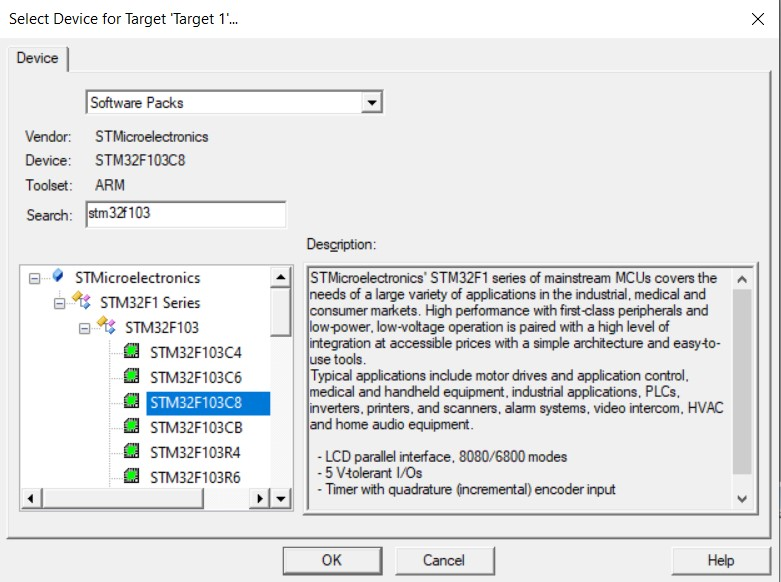
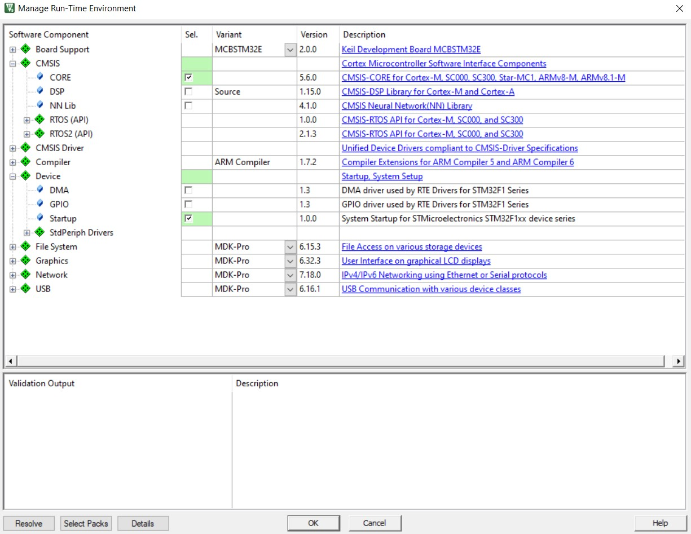
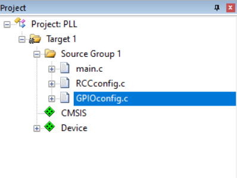

# STM32 GPIO and PLL Register-Level Tutorial

Bare-metal configuration of GPIO pins and PLL on STM32F103C8T6
without using HAL or LL libraries.

## Features
- Configure GPIO pins (set, reset, toggle)
- Configure PLL to achieve 72MHz system clock
- Support for multiple pins and ports
-PLLconfig.c and GPIOconfig.c contain the PLL and GPIO functions, while main.c provides an example of how to use them.

## Usage

1. Clone the repository:
   ```bash
   git clone https://github.com/ali-hayati/STM32-GPIO-Register-Level.git

### Parts and software Required	
I am going to use Keil IDE for the STM32 Register programming. I am also using STM32F103C8 series MCU for these projects.

-Keil MDK-ARM
-STM32F103C8 Development board
-ST-Link V2 Programmer
- Proteuse V.8 (this Project simulink with Proteuse

### Create the Project in Keil IDE
	Let’s begin by creating a project in Keil and selecting the 	appropriate microcontroller.
	



Next, we need to include some essential files in the project. Select the CMSIS core and the Device Startup files, as shown below.




Then, add the main file to the project. Along with it, I have also included RccConfig.h and RccConfig.c and GPIOconfig.c and GPIOconfig.h. These files will contain the code for the clock setup and function related to GPIO.





### Functions Descriptions

| Function         | Description                                                                    |
| ---------------- | ------------------------------------------------------------------------------ |
| `GPIOconfig`     | Configure one or more pins on a GPIO port with desired mode and configuration. |
| `GPIO_Write_Pin` | Set or reset a specific GPIO pin.                                              |
| `GPIO_Toggle`    | Toggle the state of a specific GPIO pin.  

###GPIO Modes and CNF Values (STM32F1 Reference)
| Mode          | CNF | Description                    |
| ------------- | --- | ------------------------------ |
| Output 10 MHz | 00  | Push-pull                      |
| Output 2 MHz  | 01  | Push-pull                      |
| Output 50 MHz | 10  | Push-pull                      |
| Input         | 00  | Analog                         |
| Input         | 01  | Floating input                 |
| Input         | 10  | Input with pull-up / pull-down |                                     |

###PLL Configuration Overview
This project includes register-level PLL configuration to achieve 72 MHz system clock.

###PLL Register Settings (STM32F103)

// Example from PLLconfig.c

RCC->CR |= RCC_CR_HSEON;           // Enable HSE
while(!(RCC->CR & RCC_CR_HSERDY)); // Wait until HSE ready
RCC->CFGR |= RCC_CFGR_PLLSRC;      // PLL source = HSE
RCC->CFGR |= RCC_CFGR_PLLMULL9;    // Multiply HSE by 9 -> 8 MHz * 9 = 72 MHz
RCC->CR |= RCC_CR_PLLON;           // Enable PLL
while(!(RCC->CR & RCC_CR_PLLRDY)); // Wait until PLL ready
RCC->CFGR |= RCC_CFGR_SW_PLL;      // Select PLL as system clock


